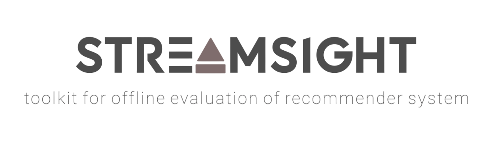
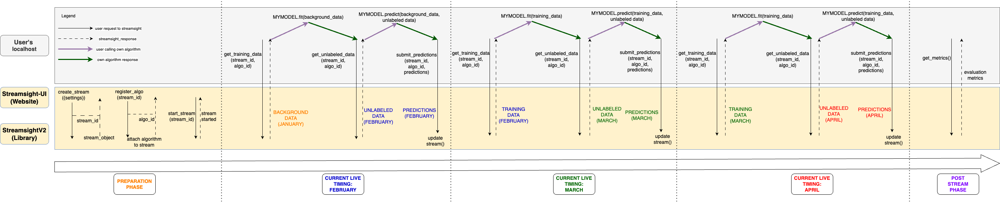
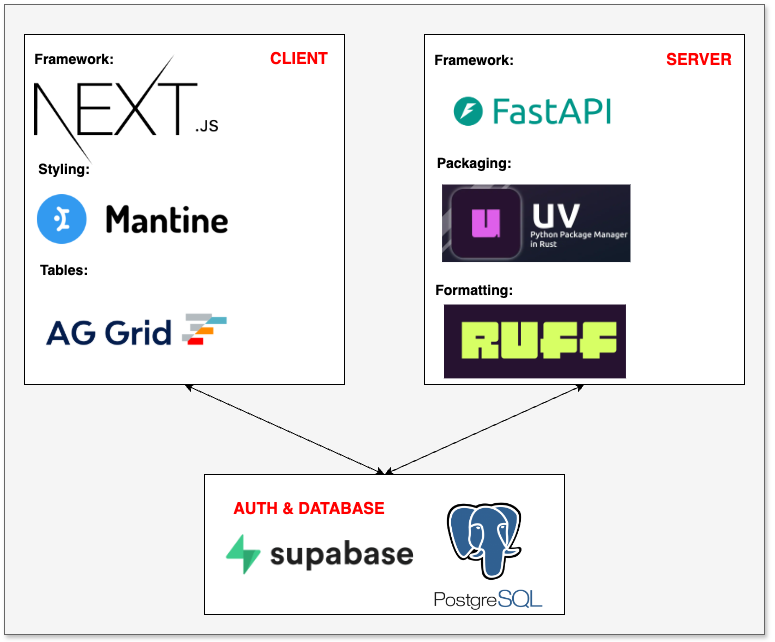

# Streamsight UI



## Overview

Streamsight UI is a web application built on top of the [Streamsight](https://github.com/suenalaba/streamsightv2) library. Streamsight UI provides an interface for users to store
their evaluator stream jobs, tune their stream settings and view evaluation metrics, on top of the existing functionalities in the Streamsight
library.

## Getting Started
To get started, run the following command. Thereafter, look into the [client's](client/README.md) and [server's](server/README.md) README for more detailed startup information.
```bash
git clone https://github.com/suenalaba/streamsight-ui.git
cd streamsight-ui
```

## Architecture
Streamsight UI follows a client-server architecture.


## Contributing
We welcome all contributors, be it reporting an [issue](https://github.com/suenalaba/streamsight-ui/issues),
or raising a [pull request](https://github.com/suenalaba/streamsight-ui/pulls) to fix an issue.

## Citation
If you use this repository in any part of your work please cite the following papers:
```bash
Ng, T. K. (2024). Streamsight: a toolkit for offline evaluation of recommender systems. Final Year Project (FYP), Nanyang Technological University, Singapore. https://hdl.handle.net/10356/181114
```
